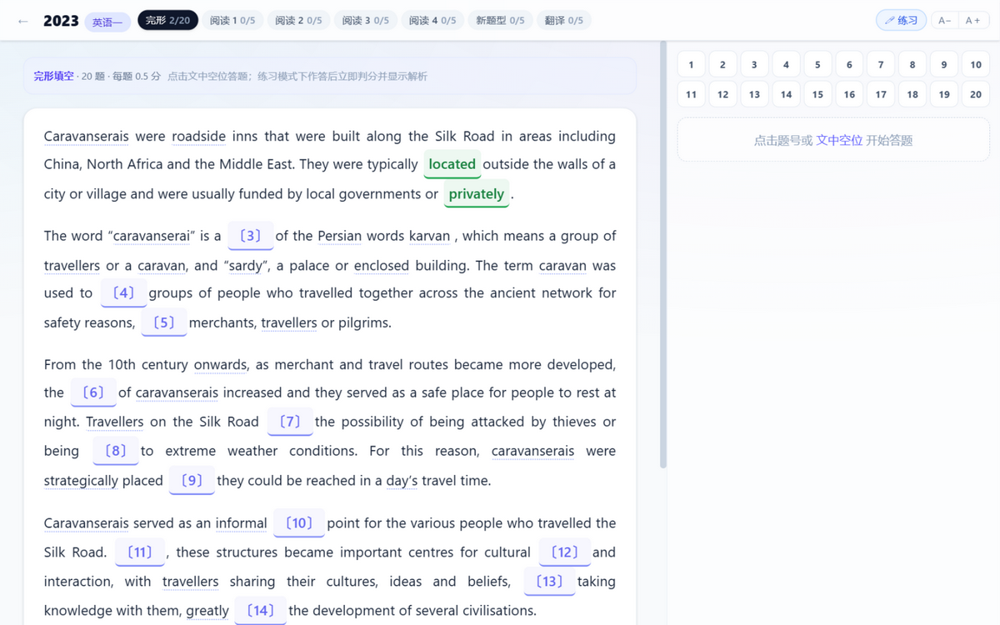

<div align="center">

# 考研英语真题题库

**英语（一）2005–2025 · 21 套 ＋ 英语（二）2010–2025 · 16 套**

做题 · 逐题精解 · 生词标注 · 单词本 · 批注 · AI 学习诊断

一个本地优先的跨平台学习应用（PWA / Windows / Android）

[📱 在线使用](https://afogsheep.github.io/kaoyan-english/) · [🤖 AI 诊断说明](CLAUDE.md)

</div>

---


## ✨ 功能

### 做题
- **完形填空**：空位内联在文章里，点击空位即弹出选项作答，不打断阅读
- **阅读理解**：左侧文章、右侧可折叠题目栏；移动端底部抽屉答题
- **新题型**：七选五 / 排序 / 小标题匹配 / 观点匹配全变体支持
- **翻译**：英语一逐句划线对照（参考译文 + 采分点拆解 + 自评）；英语二整段翻译模式
- **双模式**：练习（即答即判）／模考（静默作答），自动保存进度，错题本可重做

### 解析与词汇
- 每题详解：精准定位、命题解密、逐项干扰项错因、技巧总结
- **每题附生词块**：低频词自动标注音标释义（基于 google 高频 5000 + 考研大纲 5530 词基准判定）
- 阅读材料中非常见词**虚线提示**，点击出释义卡
- 内置 6600+ 词条离线词典，**选中任意文字**（拖选/长按）即可查词、加单词本、批注

### 单词本 · 批注 · 复习
- 单词本：一键收藏自动带释义/原文例句/出处，可编辑用法备注
- SRS 间隔复习（认识/模糊/不认识三档调度）
- 批注：任意词句下写笔记，原文处显示标记，点击展开/收纳，可从列表跳回原文

### 🤖 AI 学习诊断
应用内自动记录学习行为日志（作答 / 查词 / 复习 / 批注），**设置 → 导出 AI 诊断数据包**得到一份自解释 JSON，发给任意 AI 助手即可获得薄弱项分析与补强计划。数据格式与诊断框架见 [CLAUDE.md](CLAUDE.md)。



## 🚀 使用

| 平台 | 方式 |
|---|---|
| **iPhone / Mac / 任意设备** | Safari 打开 [afogsheep.github.io/kaoyan-english](https://afogsheep.github.io/kaoyan-english/) → 添加到主屏幕（全屏、离线可用） |
| **Windows** | 本地打包：`npm run electron:build` → `app/release/*.exe`（NSIS 安装器） |
| **Android** | 本地打包：`npm run android:apk` → APK（Android 5.0+，需本机 Android SDK；或直接用 PWA） |

> iOS/macOS 官方安装包需 Mac + Xcode + 开发者账号签名，故以 PWA 形式提供，体验等同独立 App。

```bash
git clone https://github.com/AFOGSHEEP/kaoyan-english.git
cd kaoyan-english/app
npm install
npm run dev                                    # 开发
npm run electron:build                         # Windows 安装包
npm run android:sync && npm run android:apk    # Android APK
```

## 📊 数据质量工程

真题数据来自开源仓库（OCR/AI 转换，不保证正确），本项目做了完整的多源校验：

- **关键发现**：同一套真题在网上有多种"选项排列版本"，答案字母必须配合选项排列才有意义——直接字母比对会大面积误判
- 采用**内容级对齐**（外部答案字母 → 选项文本 → 对齐本库排列）+ 逐题英文原词锚点验证
- 交叉源：pfoocc 答案键与选项文本、TsekaLuk 答案 PDF、新东方 / 中国教育在线 / 聚创 PDF 等权威答案页
- 结论：**1665 道客观题全部完成验证，仅修正 3 处真实错误**（2013 英一完形 Q6、2024 英一新题型 Q42、1 处 OCR），完形 + 阅读答案置信度极高

内容管线（可重放）：

```bash
cd scripts
node fetch-sources.mjs    # 拉源数据（走 api.github.com）
node build-content.mjs    # 37 套 → content/papers/*.json
node adjudicate-e2.mjs    # 英语二答案内容级对齐
node finalize.mjs         # 终局修正 + verified 标记
node enhance.mjs          # 翻译采分点 + 每题生词块
node build-vocab.mjs      # 词表基准 + 词典
node deploy-pages.mjs     # 发布 GitHub Pages（gh-pages 分支）
```

## 🛠 技术栈

React 18 · TypeScript · Vite · Tailwind CSS v4 · Dexie (IndexedDB) · Zustand · vite-plugin-pwa · Electron · Capacitor

```
app/src/
  lib/logger.ts     # 行为日志 + AI 诊断包生成
  lib/text.ts       # 分句/tokenize/词形还原/SRS
  components/       # InteractiveText（选词/批注/生词引擎）等
  views/            # 完形/阅读/新题型/翻译
scripts/            # 内容管线（见上）
content/            # 生成的试卷内容（37 套）
```

数据存储全部在**本地 IndexedDB**（无账号、无后端、无追踪），支持一键导出/导入备份与跨设备迁移。

## 📄 数据来源与许可

- 题目数据：[LIziak112/structured-kaoyan-english](https://github.com/LIziak112/structured-kaoyan-english)（题目数据允许任意使用；解析 CC BY-NC 4.0）
- 文本校对：[XixiGod7/kaoyan-english](https://github.com/XixiGod7/kaoyan-english)（MIT）
- 答案校验：[pfoocc/201_204_kaoyan](https://github.com/pfoocc/201_204_kaoyan)、[TsekaLuk/Kaoyan-English1-Papers](https://github.com/TsekaLuk/Kaoyan-English1-Papers)、新东方 / 中国教育在线等公开答案页
- 词典与词表：kaoyan1_dict（MIT）、考研大纲 5530 词表、google-10000-english

个人学习用途。源数据经 OCR/AI 转换，已做多源交叉校验，仍可能存在个别错误（存疑题有标记）；公开传播解析内容前请自行确认许可。

## 🤝 给 AI 助手

本项目带 [CLAUDE.md](CLAUDE.md)：包含学习诊断的数据格式与五步诊断框架、项目结构、构建命令与已知坑。维护本项目或分析学习数据的 AI 请先阅读它。
